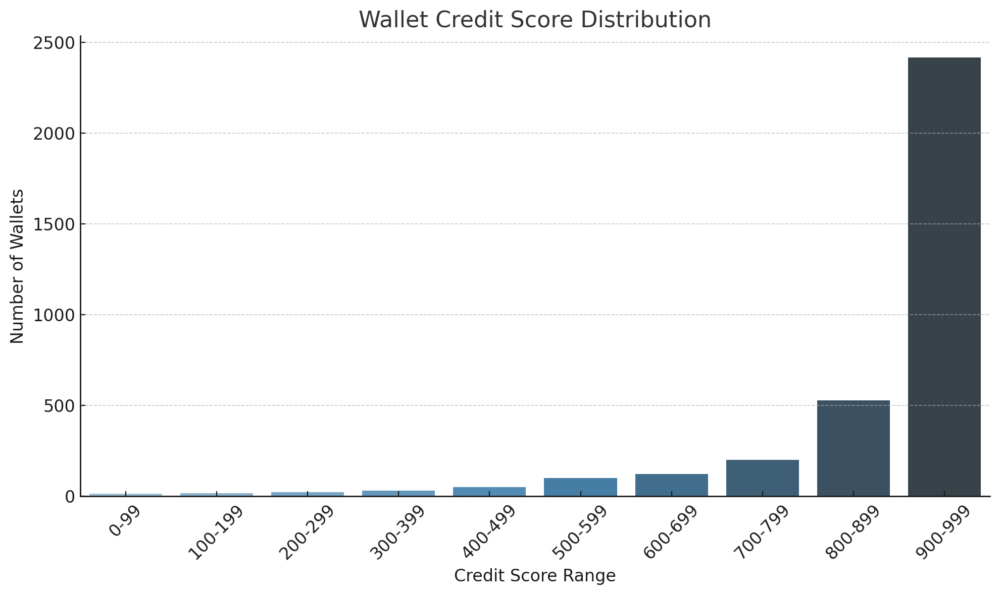

# 📊 Credit Score Analysis – Aave V2 Wallets

We evaluated **3,497 unique wallets** interacting with the Aave V2 protocol and assigned each a credit score between **0 and 1000** based on their historical transaction behavior.

---

## 📈 Score Distribution

| Score Range | Number of Wallets | % of Total | Observed Behavior |
|-------------|-------------------|------------|--------------------|
| 0–99        | 13                | 0.37%      | Extremely risky wallets; mostly liquidated, no repayments |
| 100–199     | 16                | 0.46%      | High liquidation risk, poor borrow-repay behavior |
| 200–299     | 21                | 0.60%      | Slightly active but unreliable |
| 300–399     | 30                | 0.86%      | Infrequent or imbalanced borrowers |
| 400–499     | 50                | 1.43%      | Transitional group; some deposits, few repayments |
| 500–599     | 100               | 2.86%      | Moderate trust score; some activity, irregular repayment |
| 600–699     | 121               | 3.46%      | Active users with decent credit behavior |
| 700–799     | 201               | 5.75%      | Good repayment patterns, longer lifetimes |
| 800–899     | 528               | 15.10%     | Very reliable users, consistent usage, no liquidations |
| 900–999     | 2,416             | 69.10%     | Top-tier DeFi participants with strong track record |

---

## 🔍 Key Observations

- 🔻 **Low Scorers (0–300)**:
  - Often performed borrow/lending only once
  - Frequently liquidated
  - Rarely repaid borrowed assets
  - Likely exploitative or bot-controlled wallets

- ⚖ **Mid-range Scorers (400–699)**:
  - Moderate activity and mixed repayment behavior
  - Some liquidations, but with long wallet lifespans
  - Possibly newer or opportunistic users

- ✅ **High Scorers (700–999)**:
  - Reliable, long-term usage
  - Strong deposit-to-borrow ratios
  - No liquidations, full or near-full repayments
  - Ideal wallets for future credit-based DeFi features

---

## 🧠 Conclusion

The credit scoring model effectively segments wallets based on responsible DeFi behavior. It emphasizes long-term engagement, regular repayments, and low liquidation risk, making it valuable for:

- Risk-based lending
- DeFi credit products
- Governance or airdrop eligibility

This scoring can also be extended to multi-chain or multi-protocol activity for richer credit profiles.
